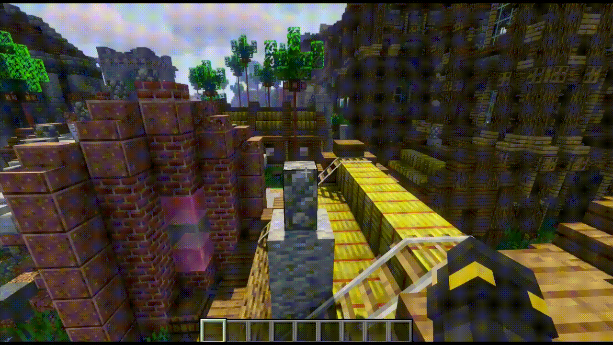

# FlowwSmoke


[](https://github.com/KapitanFloww/FlowwSmoke/releases)
[](http://floww-industries.de:8099/blue/organizations/jenkins/FlowwSmoke/activity?branch=main)
[](https://www.gnu.org/licenses/gpl-3.0)

FlowwSmoke is a Java Minecraft/Spigot plugin for placing fireplace-like particle spawners anywhere.



## Installation

### Download
Simple download the latest `jar`-file from [Jenkins](http://floww-industries.de:8099/blue/organizations/jenkins/FlowwSmoke/activity?branch=main).
Select the latest build, click on "Artifacts" and download the `jar`-file.

Alternatively, download the latest release-version from [GitHub Releases](https://github.com/KapitanFloww/FlowwSmoke/releases).

### Build the plugin yourself
Clone this repository using `git` and execute the following command inside the projects root folder:
````shell
mvn clean package
````
Then, simply copy the `FlowwSmoke-*.jar` from the `/target`-folder to your servers `plugins`-folder and start your server.

## Usage

The following commands are available in-game:

| Command                 | Permission    | Description                                             |
|-------------------------|---------------|---------------------------------------------------------|
| `/smoke`                | `floww.smoke` | Place a new smoke location at your current target block |
| `/smoke help`           | `floww.smoke` | Open a help page                                        |
| `/smoke list [world]`   | `floww.smoke` | List all smokes [in given world]                        |
| `/smoke remove`         | `floww.smoke` | Remove all smokes locations                             |
| `/smoke remove (id)`    | `floww.smoke` | Remove smoke location with given id                     |
| `/smoke remove [world]` | `floww.smoke` | Remove all smoke locations of given world               |


## Contributing & Bugs
If you find a bug :bug:, simply open a new issue in GitHub and describe what's wrong.

Pull requests are welcome. For major changes, please open an issue first to discuss what you would like to change.
Please make sure to update tests as appropriate.
